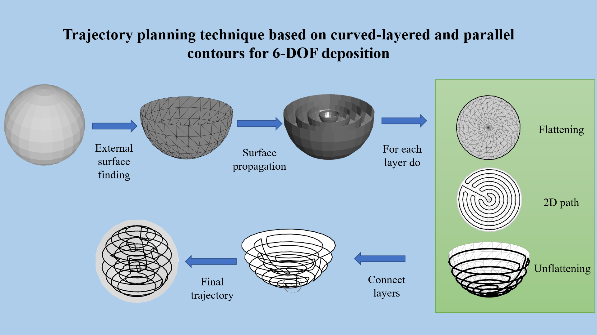

# Code for Trajectory planning technique for 6-DOF deposition

Resources and extra documentation for the manuscript "Trajectory planning technique based on curved-layered and parallel contours for 6-DOF deposition" published in IEEE Latin America Transactions. The project hierarchy and folders description is as follows:
1. codeForPlanningGeneration
2. functions
3. functionsToContour
4. images
5. main.m

Requirements

* Matlab 2021b or later. All additional packages (only needed codes) were uploaded in this repository.
  * Signal Toolbox, General Toolbox and Graph Toolbox (G. Peyré, The Numerical Tours of Signal Processing - Advanced Computational Signal and Image Processing IEEE Computing in Science and Engineering, vol. 13(4), pp. 94-97, 2011).
  * Inpolyhedron - are points inside a triangulated volume? Toolbox for Matlab (Version 3.3.0.0 (22.4 KB) by Sven).
  * stlTools for Matlab (Version 1.1.0.0 (1.58 MB) by Pau Micó).

* Pieces in STL format
  * Sphere
  * Christmas Star by wslab
  * Spinning by PraetorianCZ
  * Icosahedron by Blokchaed
  * Queen by ChaosCoreTech
